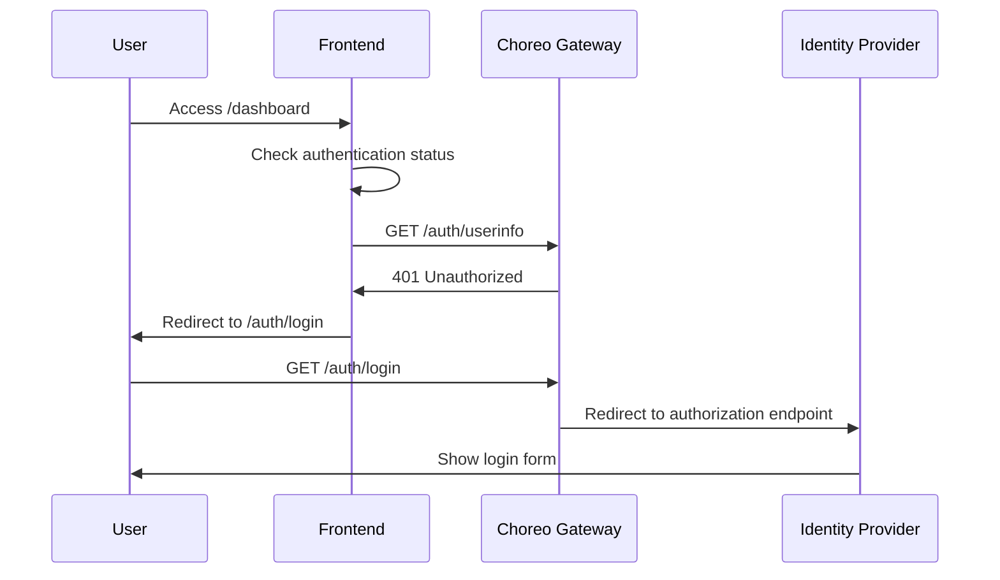
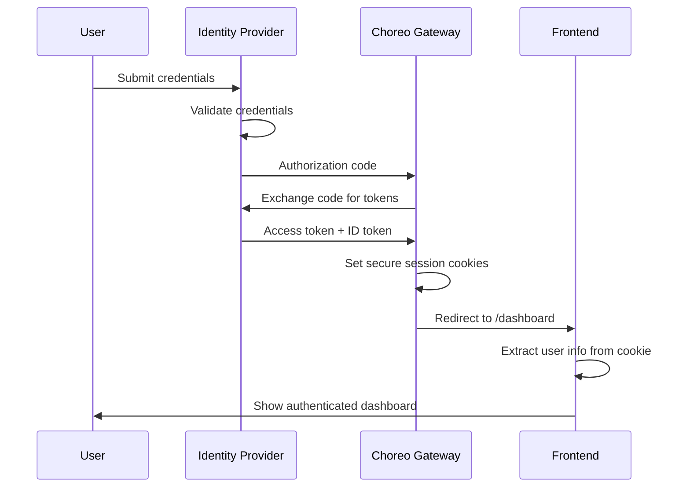
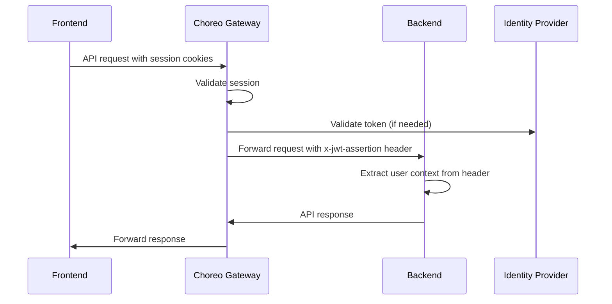

# Choreo Authentication Flow Documentation

This document provides a comprehensive explanation of how authentication works in the Task Management full-stack application using WSO2 Choreo's managed authentication system.

## 🔐 Overview

Choreo's managed authentication follows the **Backend for Frontend (BFF)** architecture pattern, which is a secure approach for browser-based applications using OIDC/OAuth2.0 protocols. This architecture ensures that OAuth tokens remain secure and are never exposed to browser-side code.

## 🏗️ Architecture Components

```
┌─────────────────┐    ┌──────────────────┐    ┌─────────────────┐    ┌─────────────────┐
│   Next.js Web   │    │  Choreo Gateway  │    │  Node.js API    │    │   Identity      │
│   Application   │◄──►│  + Auth Proxy    │◄──►│    Service      │    │   Provider      │
│                 │    │                  │    │                 │    │   (Asgardeo)    │
└─────────────────┘    └──────────────────┘    └─────────────────┘    └─────────────────┘
```

### Key Components

1. **Frontend (Next.js)**: Handles user interface and authentication triggers
2. **Choreo Gateway**: Manages authentication proxy and token handling
3. **Backend (Node.js)**: Receives authenticated user context via headers
4. **Identity Provider**: Asgardeo (Choreo's built-in IdP) or external providers

---

## 🔄 Authentication Flow

### 1. Initial Access (Unauthenticated User)



### 2. User Authentication



### 3. API Requests (Authenticated)



---

## 🔧 Implementation Details

### Frontend Authentication Integration

#### 1. Login Implementation

```typescript
// Redirect to Choreo login endpoint
const login = (redirectPath?: string): void => {
  const loginUrl = '/auth/login'
  const url = redirectPath 
    ? `${loginUrl}?redirect=${encodeURIComponent(redirectPath)}` 
    : loginUrl
  window.location.href = url
}
```

#### 2. User Info Extraction

```typescript
// Extract user info from cookie after login
const getUserInfoFromCookie = (): User | null => {
  const encodedUserInfo = Cookies.get('userinfo')
  
  if (!encodedUserInfo) return null

  // Decode base64 encoded user info
  const userInfo = JSON.parse(atob(encodedUserInfo))
  
  // Clear cookie after reading (security best practice)
  Cookies.remove('userinfo', { path: '/' })
  
  return {
    id: userInfo.sub,
    email: userInfo.email,
    name: userInfo.name,
    username: userInfo.preferred_username,
    groups: userInfo.groups || [],
    roles: userInfo.roles || []
  }
}
```

#### 3. Authentication Status Check

```typescript
// Check if user is authenticated via API call
const checkAuthStatus = async (): Promise<AuthResult> => {
  const response = await fetch('/auth/userinfo', {
    credentials: 'include'
  })

  if (response.ok) {
    const userInfo = await response.json()
    return { isAuthenticated: true, user: userInfo }
  } else if (response.status === 401) {
    return { isAuthenticated: false, user: null }
  } else {
    throw new Error('Auth check failed')
  }
}
```

#### 4. Logout Implementation

```typescript
// Logout with session hint
const logout = (): void => {
  const sessionHint = Cookies.get('session_hint')
  const logoutUrl = sessionHint 
    ? `/auth/logout?session_hint=${sessionHint}`
    : '/auth/logout'
  
  // Clear local state
  clearStoredUserData()
  
  window.location.href = logoutUrl
}
```

#### 5. Session Expiry Handling

```typescript
// Handle 401 responses from API calls
const handleSessionExpiry = (): void => {
  console.log('Session expired, redirecting to login...')
  clearStoredUserData()
  login(window.location.pathname)
}

// API client with automatic session handling
const apiRequest = async (url: string, options: RequestInit) => {
  const response = await fetch(url, {
    ...options,
    credentials: 'include'
  })

  if (response.status === 401) {
    handleSessionExpiry()
    throw new Error('Session expired')
  }

  return response
}
```

### Backend Authentication Integration

#### 1. Authentication Middleware

```javascript
const authMiddleware = (req, res, next) => {
  try {
    // Extract JWT assertion from Choreo gateway
    const jwtAssertion = req.headers['x-jwt-assertion']
    
    if (!jwtAssertion) {
      return res.status(401).json({ error: 'Authentication required' })
    }

    // Decode JWT (already validated by Choreo gateway)
    const decoded = jwt.decode(jwtAssertion)
    
    // Extract user context
    req.user = {
      sub: decoded.sub,
      email: decoded.email,
      name: decoded.name,
      preferred_username: decoded.preferred_username,
      groups: decoded.groups || [],
      roles: decoded.roles || []
    }

    next()
  } catch (error) {
    return res.status(401).json({ error: 'Authentication failed' })
  }
}
```

#### 2. User Context Usage

```javascript
// Use authenticated user context in API endpoints
app.get('/api/tasks', authMiddleware, (req, res) => {
  const userId = req.user.sub
  const userTasks = tasks.filter(task => task.userId === userId)
  res.json({ tasks: userTasks })
})

app.post('/api/tasks', authMiddleware, (req, res) => {
  const newTask = {
    ...req.body,
    userId: req.user.sub,
    createdBy: req.user.name || req.user.email
  }
  // Save task logic...
})
```

---

## 🔒 Security Features

### 1. Secure Cookie Handling

- **HttpOnly Cookies**: Prevent XSS attacks by making cookies inaccessible to JavaScript
- **Secure Flag**: Ensures cookies are only sent over HTTPS
- **SameSite Attribute**: Prevents CSRF attacks
- **Short-lived userinfo Cookie**: 2-minute expiry for security

### 2. Token Security

- **No Token Exposure**: OAuth tokens never reach the browser
- **Server-side Validation**: All token validation happens on Choreo gateway
- **Automatic Refresh**: Token refresh handled transparently
- **Secure Storage**: Tokens stored securely on the server side

### 3. Session Management

- **Configurable Expiry**: Session timeout configurable (default 7 days)
- **Automatic Cleanup**: Expired sessions automatically cleaned up
- **Session Validation**: Each request validates session state
- **Logout Cleanup**: Proper session cleanup on logout

---

## 🛠️ Configuration Options

### Frontend Configuration

```yaml
# .choreo/component.yaml
webApp:
  managedAuth:
    enabled: true
    postLoginPath: /dashboard
    postLogoutPath: /
    errorPath: /auth/error
    sessionExpiryTime: 10080  # 7 days in minutes
    additionalScopes: []
```

### Authentication Paths

| Path | Purpose | Description |
|------|---------|-------------|
| `/auth/login` | Login initiation | Redirects to identity provider |
| `/auth/logout` | Logout initiation | Clears session and redirects |
| `/auth/userinfo` | User info endpoint | Returns current user information |
| `/auth/login/callback` | Login callback | Handles post-login redirect |
| `/auth/logout/callback` | Logout callback | Handles post-logout redirect |

### Session Configuration

```typescript
interface SessionConfig {
  postLoginPath: string      // Where to redirect after login
  postLogoutPath: string     // Where to redirect after logout
  errorPath: string          // Where to redirect on auth errors
  sessionExpiryTime: number  // Session timeout in minutes
  additionalScopes: string[] // Extra OAuth scopes
}
```

---

## 🔍 Debugging Authentication

### 1. Frontend Debugging

```typescript
// Enable debug logging
if (process.env.NEXT_PUBLIC_DEBUG === 'true') {
  console.log('Auth status:', { isAuthenticated, user })
  console.log('Session cookies:', document.cookie)
}
```

### 2. Backend Debugging

```javascript
// Log authentication details
if (process.env.LOG_LEVEL === 'debug') {
  console.log('JWT assertion:', req.headers['x-jwt-assertion'])
  console.log('User context:', req.user)
}
```

### 3. Common Debug Scenarios

1. **Check Cookie Presence**
   ```javascript
   // In browser console
   console.log('Cookies:', document.cookie)
   ```

2. **Verify API Authentication**
   ```bash
   # Check if API calls include credentials
   curl -i -X GET https://your-app/auth/userinfo \
     -H "Cookie: session=..." \
     --include
   ```

3. **Monitor Network Requests**
   - Use browser DevTools Network tab
   - Check for 401 responses
   - Verify cookies are sent with requests

---

## 🚨 Troubleshooting

### Common Issues and Solutions

1. **Login Redirect Loop**
   ```
   Issue: User gets stuck in login redirect loop
   Cause: Incorrect postLoginPath or authentication configuration
   Solution: Verify authentication paths in component.yaml
   ```

2. **Session Not Persisting**
   ```
   Issue: User gets logged out on page refresh
   Cause: Cookies not being set or stored properly
   Solution: Check cookie settings and browser compatibility
   ```

3. **API Authentication Failures**
   ```
   Issue: API calls return 401 even when logged in
   Cause: Missing or incorrect x-jwt-assertion header
   Solution: Verify backend authentication middleware
   ```

4. **CORS Issues**
   ```
   Issue: Authentication requests blocked by CORS
   Cause: Incorrect CORS configuration
   Solution: Update CORS settings to allow credentials
   ```

### Error Handling

1. **Frontend Error Handling**
   ```typescript
   try {
     const authResult = await checkAuthStatus()
     // Handle success
   } catch (error) {
     if (error.status === 401) {
       // Redirect to login
       login()
     } else {
       // Handle other errors
       showErrorMessage(error.message)
     }
   }
   ```

2. **Backend Error Handling**
   ```javascript
   app.use((err, req, res, next) => {
     if (err.name === 'UnauthorizedError') {
       res.status(401).json({ error: 'Authentication required' })
     } else {
       res.status(500).json({ error: 'Internal server error' })
     }
   })
   ```

---

## 📚 Best Practices

### 1. Security Best Practices

- Always use HTTPS in production
- Implement proper CORS policies
- Validate user input on both frontend and backend
- Use secure cookie settings
- Implement proper session timeout handling

### 2. User Experience Best Practices

- Provide clear authentication status indicators
- Handle session expiry gracefully
- Show appropriate loading states during auth operations
- Provide helpful error messages for auth failures

### 3. Development Best Practices

- Use environment-specific configurations
- Implement comprehensive error handling
- Add proper logging for debugging
- Test authentication flows thoroughly
- Document authentication requirements

---

## 🔗 Related Resources

- [WSO2 Choreo Authentication Documentation](https://wso2.com/choreo/docs/authentication-and-authorization/)
- [Asgardeo Documentation](https://wso2.com/asgardeo/docs/)
- [OAuth 2.0 and OIDC Best Practices](https://tools.ietf.org/html/draft-ietf-oauth-security-topics)
- [Backend for Frontend Pattern](https://docs.microsoft.com/en-us/azure/architecture/patterns/backends-for-frontends)

---

This authentication flow provides a secure, scalable, and user-friendly authentication experience for full-stack applications on the Choreo platform.
